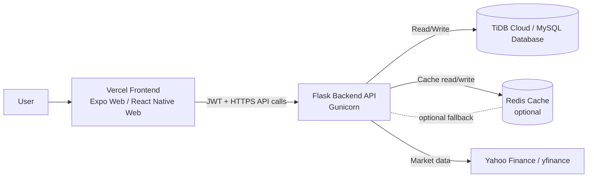
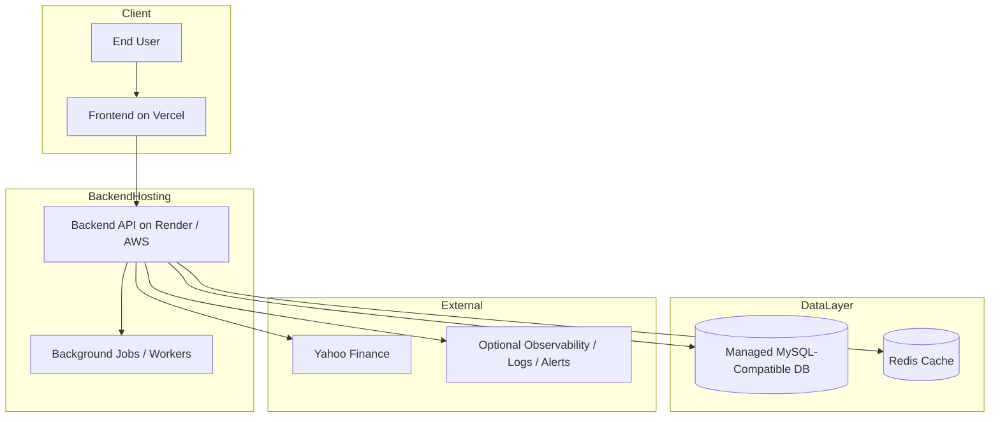

# SalesTrading Technical Document

## 1. Overview

SalesTrading is a quantitative trading and investment simulation platform for students. It provides authentication, stock search and price lookup, portfolio trading, thesis submission, scoring, and leaderboard functionality.

The system is split into three main layers:
- Frontend: Expo/React Native app, deployed on Vercel for web
- Backend: Flask REST API, deployed separately on a web host such as Render or AWS
- Database: MySQL-compatible relational database, currently TiDB Cloud / MySQL-compatible storage

The application is designed as a multi-user educational trading platform with JWT-based access control, live market data integration, portfolio tracking, and scoring logic.

## 2. Product Goals

- Allow users to register and log in securely
- Let users search stocks and inspect market data
- Let users execute simulated BUY/SELL trades
- Track holdings, portfolio value, cash balance, and returns
- Score users based on portfolio performance, diversification, execution, and thesis quality
- Display a leaderboard and per-user score breakdown

## 3. Technology Stack

### Frontend
- Expo
- React Native
- Expo Router
- React Native Web
- TypeScript
- Web deployment on Vercel

### Backend
- Python 3.11+
- Flask
- Flask-JWT-Extended
- Flask-CORS
- Flask-SQLAlchemy
- PyMySQL
- Gunicorn
- yfinance
- pandas
- numpy

### Database
- MySQL-compatible relational database
- Local development uses Docker MySQL
- Production can use TiDB Cloud or another MySQL-compatible managed database

### DevOps / Hosting
- Docker
- Docker Compose
- Vercel for frontend
- Render or AWS for backend
- TiDB Cloud or managed MySQL for database

## 4. Repository Structure

- `backend/` - Flask API and business logic
- `frontend/DRA App/` - Expo application
- `docs/` - design notes and technical docs
- `docker-compose.yml` - local full-stack orchestration
- `tradeiq_dump_20260607_220248.sql` - database dump

## 5. High-Level Architecture

### Request Flow
1. User opens the frontend in browser or mobile web.
2. Frontend sends API requests to the backend URL.
3. Backend authenticates requests using JWT.
4. Backend reads and writes data in the relational database.
5. Backend fetches live market data from Yahoo Finance through `yfinance`.
6. Backend returns JSON responses to the frontend.

### Logical Diagram



```text
User
  -> Vercel Frontend (Expo Web)
  -> Flask Backend API
  -> TiDB Cloud / MySQL Database
  -> Yahoo Finance API via yfinance
```

### Deployment View



## 6. Frontend

### Purpose
The frontend provides the user interface for:
- Registration and login
- Market search and price display
- Portfolio trading
- Holdings and portfolio summary
- Analytics and leaderboard views

### API Connection
The frontend reads the backend base URL from:
- `EXPO_PUBLIC_API_URL`

If the environment variable is missing, the current fallback points to the backend deployment URL.

### Frontend Implementation Notes
- API requests are centralized in `frontend/DRA App/src/native/api.ts`
- JWT token is stored in local storage when available, with an in-memory fallback
- All authenticated routes send `Authorization: Bearer <token>`

## 7. Backend

### Purpose
The backend is a Flask REST API that handles:
- User registration and login
- Stock lookup and price retrieval
- Portfolio trade execution
- Holdings and portfolio summaries
- Thesis and scoring workflows
- Leaderboard calculations

### App Entry Point
- `backend/run.py` creates the Flask app and starts the server
- Production runs under Gunicorn

### App Factory
- `backend/app/__init__.py` creates the Flask app
- Extensions are initialized there
- Blueprints are registered there
- Optional table creation is controlled by `AUTO_CREATE_TABLES`

### Backend Modules
- `app/auth/` - registration and login
- `app/market/` - stock lookup, historical market data, benchmark data, and search
- `app/portfolio/` - trade execution, holdings, and portfolio summaries
- `app/analytics/` - score computation and leaderboard logic
- `app/scoring/` - scoring engines used by analytics
- `app/cache.py` - optional shared cache helper
- `app/jobs.py` - lightweight job helper for asynchronous work

## 8. Authentication and Authorization

### Authentication
- Users register with email and password
- Passwords are hashed with SHA-256 in the current implementation
- Login returns a JWT access token
- JWT is required for most endpoints

### Authorization Model
- Authenticated users can access portfolio, market, and analytics endpoints
- Score access is restricted to the user themselves or an admin

### Notes
- CORS is currently open to all origins
- JWT secrets and Flask secrets must come from environment variables in production

## 9. API Overview

### Authentication
- `POST /auth/register`
- `POST /auth/login`

### Market
- `GET /market/stock/<ticker>`
- `GET /market/history/<ticker>`
- `GET /market/benchmark`
- `GET /market/price/<ticker>`
- `GET /market/indices`
- `GET /market/search`

### Portfolio
- `POST /portfolio/trade`
- `GET /portfolio/holdings/<user_id>`
- `GET /portfolio/summary/<user_id>`
- `GET /portfolio/trades/<user_id>`

### Analytics
- `GET /analytics/leaderboard`
- `GET /analytics/scores/<user_id>`
- `POST /analytics/compute/<user_id>`
- `POST /analytics/compute-legacy/<user_id>`
- `GET /analytics/risk/<user_id>`

### Health
- `GET /health`

## 10. Database Design

The system uses a relational schema with the following tables:

- `users`
- `portfolio_setup`
- `trade_log`
- `holdings`
- `investment_thesis`
- `thesis_scores`
- `risk_metrics`
- `weekly_scores`
- `leaderboard`
- `reports`

### Table Purpose Summary

- `users` stores account and profile information
- `portfolio_setup` stores starting capital and portfolio configuration
- `trade_log` stores each buy/sell trade
- `holdings` stores current positions per user
- `investment_thesis` stores user-written trade rationale
- `thesis_scores` stores scoring details for thesis evaluation
- `risk_metrics` stores risk-related calculations
- `weekly_scores` stores weekly scoring snapshots
- `leaderboard` stores ranked performance per week
- `reports` stores generated report references

### Data Relationships
- One user can have one portfolio setup
- One user can have many trades
- One user can have many holdings
- One trade can have one thesis
- One thesis can have one thesis score
- One user can have many weekly scores
- One user can have many leaderboard entries

## 11. Business Logic

### Trading Flow
1. User submits a BUY or SELL trade
2. Backend fetches live price and stock metadata
3. Backend checks portfolio cash or holdings
4. Backend writes the trade into `trade_log`
5. Backend updates `holdings`
6. Backend updates portfolio cash balance
7. Backend returns the trade result

### Portfolio Summary Flow
1. Backend loads the portfolio setup row
2. Backend loads all holdings
3. Market value and PnL are calculated from latest prices
4. Portfolio total and return are returned to the frontend

### Analytics Flow
1. Backend loads trades and holdings
2. Backend computes portfolio, risk, thesis, execution, and strategy scores
3. Weekly scores and leaderboard entries are updated
4. Frontend consumes the score breakdown and leaderboard

## 12. Market Data Integration

The backend uses `yfinance` to fetch:
- Stock metadata
- Live/near-live prices
- Historical price data
- Benchmark data
- Market index snapshots

### Caching
- Market indices are cached through `app/cache.py`
- If Redis is configured, cache is shared across instances
- If Redis is not configured, a local in-memory fallback is used

### Important Note
The system depends on an external data source for market data. This means:
- data availability is partially dependent on Yahoo Finance
- request latency can vary
- rate limiting or outages can affect market endpoints

## 13. Configuration and Environment Variables

### Core Variables
- `FLASK_ENV`
- `SECRET_KEY`
- `JWT_SECRET_KEY`
- `JWT_EXPIRES_DAYS`

### Database Variables
- `DB_HOST`
- `DB_PORT`
- `DB_NAME`
- `DB_USER`
- `DB_PASSWORD`
- `DB_SSL`
- `DB_SSL_VERIFY`
- `DB_SSL_CA`
- `DB_SSL_CA_PEM`
- `DB_POOL_RECYCLE`

### Cache and Rate Limit
- `REDIS_URL`
- `CACHE_TTL_SECONDS`
- `ENABLE_RATE_LIMITS`

### Deployment Helpers
- `AUTO_CREATE_TABLES`
- `PORT`

## 14. Local Development Setup

### Docker Compose
The easiest local setup is:
- start MySQL with Docker Compose
- start the backend container
- start the frontend container

### Local URLs
- Frontend: `http://localhost:8081`
- Backend: `http://localhost:5000`
- Database: `localhost:3306`

### Local Defaults
- MySQL runs with an empty password in dev
- Backend connects to the local Docker service name `mysql`
- Frontend points to local backend URL unless overridden

## 15. Deployment Setup

### Frontend
- Host on Vercel
- Set `EXPO_PUBLIC_API_URL` to the backend URL

### Backend
- Host as a web service on Render or AWS
- Use Gunicorn in production
- Bind to the platform-provided `PORT`
- Use environment variables for all secrets and DB credentials

### Database
- Host on TiDB Cloud or another managed MySQL-compatible service
- Use SSL/TLS in production
- Keep database credentials outside source control

## 16. Security Considerations

### Already Present
- JWT-based authentication
- SSL/TLS support for database connections
- Environment-based config support
- Optional rate limiting support
- CORS enabled for browser access

### Still Recommended
- Replace SHA-256 password hashing with a stronger password hashing scheme such as bcrypt or Argon2
- Restrict CORS origins to the real frontend domain
- Use secret storage rather than plain environment files in production
- Add stricter authorization checks for sensitive admin endpoints
- Add centralized audit logging
- Add WAF or API gateway protections in cloud deployment

## 17. Scaling Considerations

### Current State
The codebase is suitable for development and early production, but not yet a fully scaled enterprise deployment.

### Missing for High Scale
- load balancing
- autoscaling
- shared cache infrastructure at scale
- queue-based background jobs
- database replicas or failover strategy
- central logging and alerting
- rate limiting at the edge

### Current Bottlenecks
- external market data calls
- synchronous request handling in some flows
- in-memory fallback cache is process-local
- database writes occur inline during requests

### Recommended Scale Improvements
- Use Redis for shared cache
- Move expensive analytics to background jobs
- Introduce a queue worker for leaderboard/scoring recalculations
- Add database read replicas if traffic grows
- Add load balancer and autoscaling for backend instances
- Add monitoring and alerting before traffic grows

## 18. Observability and Operations

Recommended operational tooling for production:
- Application logs
- Request tracing
- Error alerts
- Health checks
- Database backup schedules
- Uptime monitoring
- Performance metrics

## 19. Known Gaps and Technical Debt

- Password hashing should be upgraded from SHA-256
- CORS is currently permissive
- Some production-hardening features are not yet fully built
- In-memory cache fallback is not enough for multiple backend instances
- Background job processing is only scaffolded, not fully implemented
- Business logic and scoring are still mostly synchronous

## 20. Future Improvements

- Migrate password hashing to bcrypt or Argon2
- Add Redis-based distributed caching
- Add Celery or RQ for scoring and report jobs
- Add structured logging and metrics
- Add stricter role-based access control
- Add API rate limiting and abuse protection
- Add database migration tooling
- Add automated tests for all major flows
- Add CI/CD checks for linting, tests, and deployment validation

## 21. Summary

SalesTrading is a functional full-stack trading simulation platform with a Flask backend, Expo frontend, and relational database. It already includes the main application logic for authentication, trading, portfolio management, scoring, and leaderboard calculations. It is well-suited for development, demos, and early users, but it still needs additional work in security, scaling, monitoring, and background processing before it can be considered enterprise-grade.
